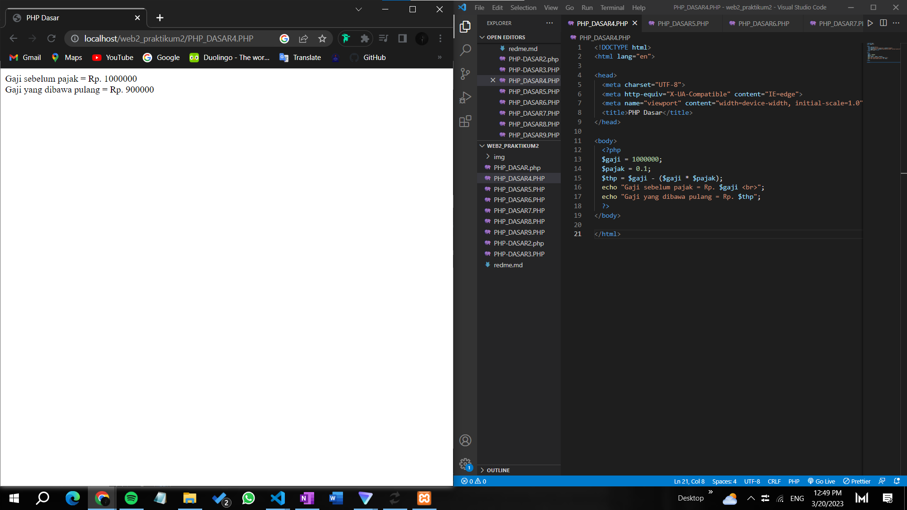

# web2_praktikum2

## TugasWeb2-Praktikum2

-   Nama : ahmad ridho
-   Kelas : TI.21.A2
-   Nim : 312110279

## HASIL

- PHP-Dasar
  

- PHP-Dasar2
  )

- PHP-Dasar3
  .png)

- PHP-Dasar4
  .png)

- PHP-Dasar5
  

- PHP-Dasar6
  

- PHP-Dasar7
  

- PHP-Dasar8
  

- PHP-Dasar9
  

- Praktikum
  

**PENJELASAN PRAKTIKUM2**  

> Code di atas merupakan contoh sederhana dari form input HTML yang menggunakan bahasa pemrograman PHP. Halaman ini memperlihatkan form input sederhana dengan tiga elemen yaitu Nama, Tanggal dan Pekerjaan, dan juga sebuah tombol "Kirim". Form ini meminta pengguna untuk memasukkan nama, tanggal lahir, dan pekerjaan, dan setelah tombol "Kirim" ditekan, data akan dikirim ke server untuk diproses. Setelah itu, informasi tersebut akan ditampilkan kembali kepada pengguna sebagai "Hasil" dari pengisian form. Pada bagian PHP, terdapat kondisi if yang mengecek apakah tombol "Kirim" telah ditekan dengan menggunakan fungsi isset($\_POST["submit"]) Jika iya, maka informasi yang dimasukkan ke dalam form akan ditampilkan kembali menggunakan echo. Pada bagian hasil, informasi yang akan ditampilkan adalah nama, tanggal lahir, pekerjaan, dan umur yang dihitung dengan menggunakan fungsi date_diff(). Selain itu, juga akan ditampilkan informasi gaji berdasarkan jenis pekerjaan yang dipilih oleh pengguna.
